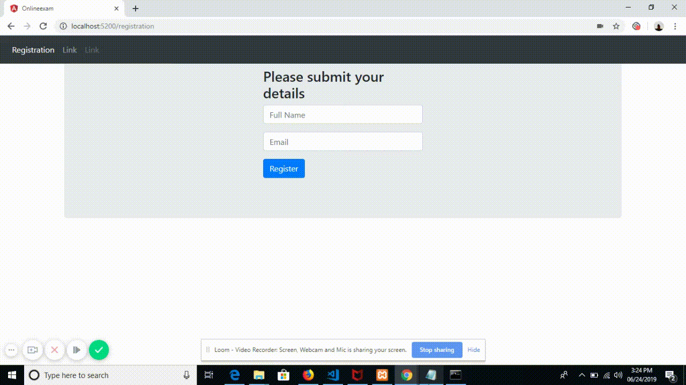

# Online Examination :customs:
An Online Examination system build in angular5 which require sign up details from user upon signup it redirect user to questionaiar page. and user will choose the answer and submit and it will redirect to the result page. it display the wrong answer in red color also correct anser is displayed below each question

# Video Demo  :video_camera:

# Getting Started  :mountain_bicyclist:

These instructions will get you a copy of the project up and running on your local machine for development purposes.

# Prerequisites  :black_nib:

You need to have nodejs and angular cli - should be install on your system.

# Installation  :beginner:

Put app ,assets folder inside the src  folder also replace thepackage.json

# Useage Instruction  :beginner:

up on installation run ng build 
# Author  :pencil2:

    shraddha Parashar- online exam

# License  :ledger:

This project is licensed under the MIT License - see the LICENSE.md file for details

# Acknowledgments  :full_moon_with_face:

 _Inspiration:_  An angular app challenge  Challenge
 